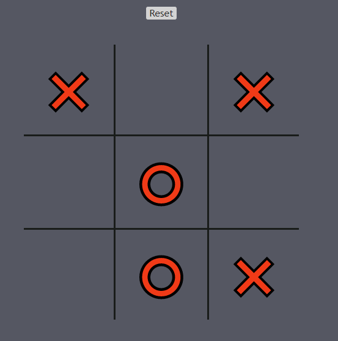
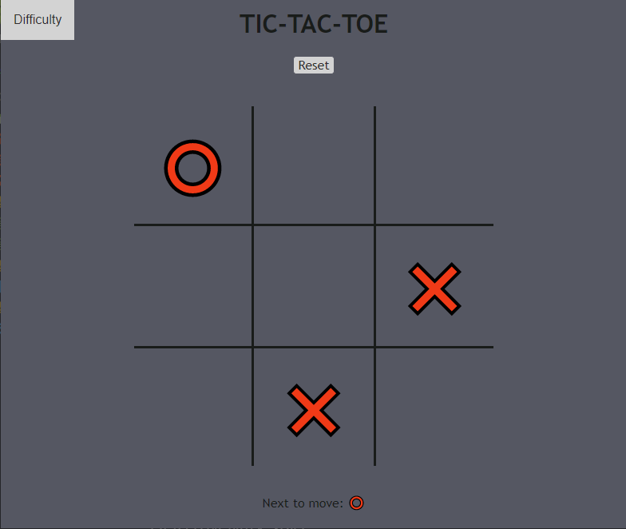

<b>Tic-Tac-Toe </b> Electron Desktop App
=

    

Classic Tic-Tac-Toe game; You can locally play against other players or match against the computer running <a href = "https://en.wikipedia.org/wiki/Minimax">Minimax</a> installed from <b>npm</b> | Or this &rarr; <a href = "https://github.com/matheushpitz/Tic-Tac-Toe-Complex-AI">repository</a>

- Powered by <a href = "https://www.electronjs.org/docs">Electron</a> ⚡

- <b>Four</b> different difficulties &rarr; <a href = "https://github.com/matheushpitz/Tic-Tac-Toe-Complex-AI/blob/master/src/EasyAI.js">Easy</a> 🤏 | <a href = "https://github.com/matheushpitz/Tic-Tac-Toe-Complex-AI/blob/master/src/MediumAI.js">Medium</a> 🤙 | <a href = "https://github.com/matheushpitz/Tic-Tac-Toe-Complex-AI/blob/master/src/HardAI.js">Hard</a> 👊| <a href = "https://github.com/matheushpitz/Tic-Tac-Toe-Complex-AI/blob/master/src/ExpertAI.js">Expert</a> 💪
- While playing 🎲, you can also <b>disable</b>❌the computer 🤖 making moves

=

   <b> 
    
        The Game 🎲 
     
   </b>

    

  

    

     You can choose the difficulty by clicking on the button 🔘 in the <b>top left</b>

===

    <b> 
        
            Problems 🤬
         
    </b>

  

    
        The computer 🤖 takes too long to calculate his moves 
    

